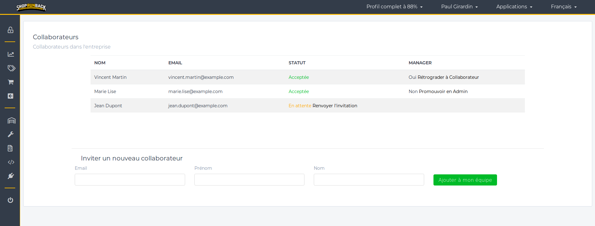
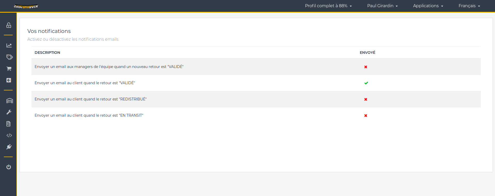

# Configurer mon compte

## Mon entreprise

Si vous ne l'avez pas fait pendant la création du compte, vous pouvez **compléter les informations de votre entreprise** dans ***Votre nom* > Mon entreprise** dans la **barre de navigation en haut à droite**.

Remplissez le formulaire et ajoutez le logo de votre entreprise. Le **logo sera affiché sur le formulaire de retour que le client remplira**, il est donc **important de le renseigner** si vous en avez un.

## Mon équipe

Vous pouvez **donner l'accès au dashboard à d'autres membres** de votre entreprise. Pour cela, allez dans la **barre de navigation en haut à droite** dans ***Votre nom* > Mon équipe** et remplissez le formulaire.

**N'importe quel membre** de l'équipe **peut inviter d'autres membres**.

Lorsque vous **ajoutez un collaborateur**, un **email est envoyé** à l'adresse email que vous avez rentrée. Cette personne aura juste à **cliquer sur le lien dans l'email** pour vous rejoindre sur ShopRunBack.

Un **nouvel arrivant** aura un rôle de **Collaborateur**.

**Seul le créateur du compte peut promouvoir ou rétrograder les membres de l'équipe**.

Les **Collaborateurs** ne **peuvent pas modifier la configuration du dashboard**.

## Notifications

Dans ***Votre nom* > Notifications** dans la **barre de navigation en haut à droite**, vous pouvez **activer ou désactiver l'envoi d'email selon certains évènements** en **cliquant sur la croix ou sur le signe de validation**.

