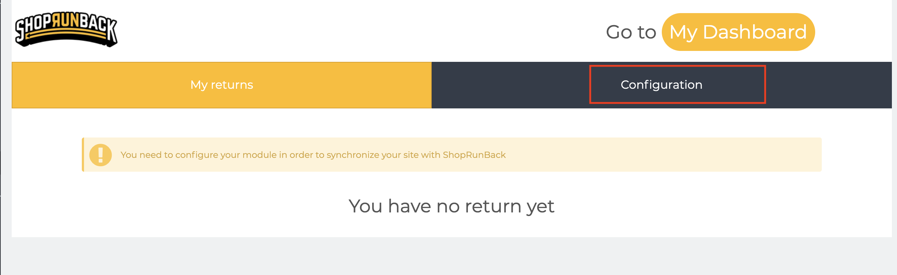

# Configure the module

## Connect my ShopRunBack account to the module

To share your data with ShopRunBack, you must use the [authentication token of your ShopRunBack account](https://dashboard.shoprunback.com/tokens).

Copy it and go back to your website.

Click on the `ShopRunBack` tab in the left menu.

| 1.6 | 1.7 |
|-|-|
|  |  |

Go to `Configuration`.

Paste your token in the `API Token` field and save your configuration.

Now, you can share your data with your ShopRunBack account!

## Synchronize your data!

To synchronize an element, click on its corresponding `Synchronize` button.

<aside class="warning">
  If you switch environment, change your API token or uninstall the module, all the return requests and synchronizations will be reset!
</aside>

## Environment

<aside class="warning">
  Be careful about which environment is set in your configuration!
</aside>

There are 2 modes:

- **Sandbox**: It is a **test** environment. The data on this environment is **reset every monday**.
- **Production**: It is where your customers' return requests are made. **This is real data!**

<aside class="warning">
  If you switch environment, change your API token or uninstall the module, all the return requests and synchronizations will be reset!
</aside>

