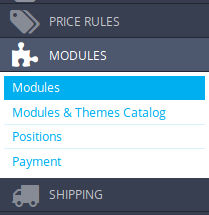
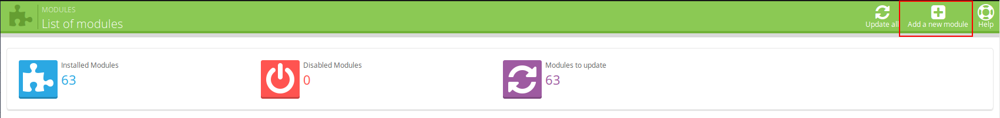
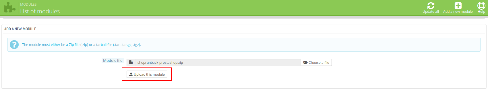
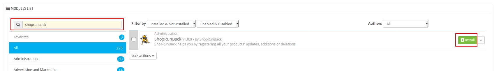
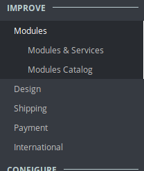
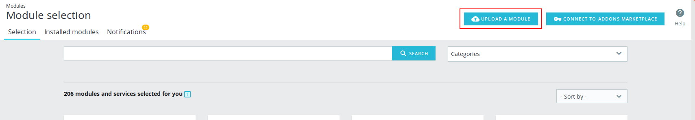

# Install the module

## Create your own ShopRunBack account

First of all, you must create your own ShopRunBack account [here](https://dashboard.shoprunback.com).

## Download the module

[Click here](https://github.com/shoprunback/prestashop-module/releases/latest) to download the module.

## Install on your site

### 1.6 version

Go to the back-office of your website, then go to `Modules`.

Click on `Add a new module`.

Click on `Choose a file`.

Select the .zip you just downloaded.

Click on `Upload this module`.

Find the ShopRunBack module and click on `Install`.

### 1.7 version

Go to the back-office of your website, then go to `Modules`.

Click on `Upload a module`.

Select the .zip you just downloaded.

The module is now installed. You can now click on `Configure` to directly go to the module configuration page.

## Troubleshooting installation

Prestashop does caching for modules and sometimes the new version is not taken in consideration and Prestashop will keep using the old version of the module.

To avoid this, before you upload the zip, make sure you have removed the current version of the module and disable cache and select `Recompile templates if the files have been updated` in the Performance section of the Advanced parameters

