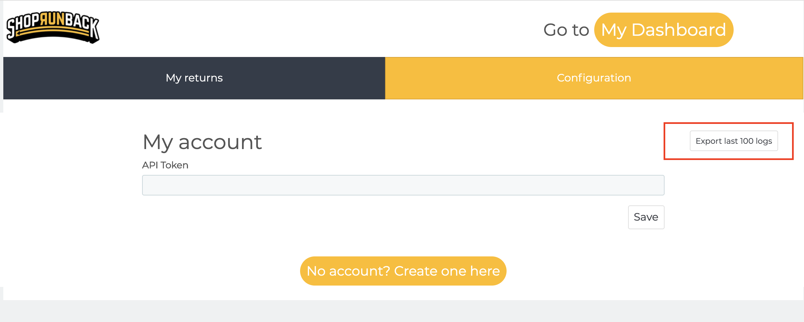

# I have a problem

## Check what went wrong

We log most of the module's actions on your log system.

To access it, just go to your back-office, and, in the left menu, go to `Advanced parameters` > `Logs`.

| 1.6 | 1.7 |
|-|-|
|  |  |

All our logs have their message beginning with `[ShopRunBack]` so you can filter them easily.

If you do something on your website **that generates an error for ShopRunBack**, you will be **notified when returning to the ShopRunBack's module page**.

When a notification occurs, **it also creates a log**. So **if you mark it as read**, you **can still find it in your logs**.

## Contact the developers

If you meet a problem you cannot solve, please **export the last logs** on the configuration tab and **send a mail to tech_at_shoprunback.com**

